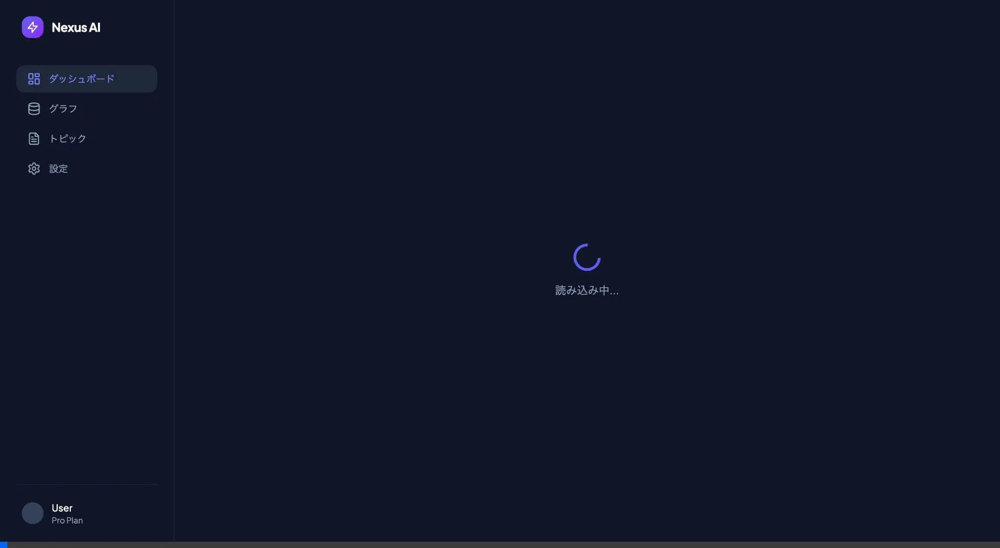
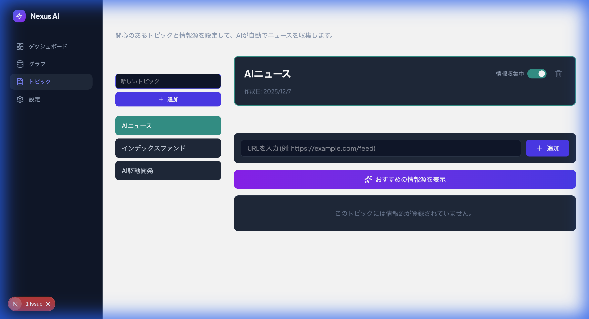

# 新AI「Google Antigravity」+ Claude Opus 4.5 はどれぐらい使えるのか？

## **📌 はじめに**

「自分専用の情報収集AIが欲しいな〜」という思いつきを、最新のモデル **Claude Opus 4.5** を搭載したAIエージェント「Antigravity」と一緒に形にできるのか試してみました。

### **今回のAntigravityは何が違う？**

前回（minc-car-service）からの最大のアップデートは以下の2点です。

1.  🧠 **AI脳が進化**: **Claude Opus 4.5** が利用可能に。コーディング力と設計力が格段に向上。
2.  👀 **目がついた**: **ブラウザを自動操作**して、自分で動作確認を行い、スクリーンショットや動画を撮ってくれる。

今回は、この「超進化した相棒」と一緒に、そこそこ複雑なアプリ開発に挑戦しました。

---

## **🛠 作ったもの: Nexus AI (Info Assistant)**

- **やりたかったこと**: 自分の興味あるトピック（AI, 投資など）を登録しておくと、AIが勝手に記事を集めて、読んで、要約して、ナレッジグラフにしてくれるWebアプリ。
- **技術スタック**:
    - Frontend: Next.js 16 (App Router)
    - Backend: Supabase (Auth, DB, RLS)
    - AI: Gemini 1.5/2.0 Flash (記事分析用)

---

## **🚀 開発の軌跡 (AIとのペアプロ日記)**

### **Phase 1: 「認証周り、セキュリティ高くしたい」 (設計・実装)**

**AIの動き**: Opus 4.5の設計力の高さに驚愕。

- **私**: 「ログイン機能をつけたい。でもNext.jsのSSRとクッキー周りでハマりそう...」
- **AI**: 「サーバーサイドでのクッキー制御は複雑になりがちです。**SupabaseのRLS（Row Level Security）**を活用し、クライアントから直接DBを叩く構成にしましょう。これが最もセキュアでシンプルです。」
- **感想**: 単に動くコードを書くだけでなく、「アーキテクチャの変更」まで提案してくる。しかも「一時的な解決策はセキュリティが下がるのでやめましょう」と諭された。頼れるシニアエンジニア感。

### **Phase 2: 「本当に動いてるの？証拠見せて」 (ブラウザ自動テスト)**

**AIの動き**: ここが今回のハイライト。勝手にブラウザを開いてテストし始めた。

- **私**: 「RLS設定したけど、本当にトピック追加できる？」
- **AI**: 「ブラウザを起動して確認します。」
    1. `http://localhost:3000` にアクセス
    2. ログイン処理を実行
    3. トピック「AIニュース」を入力して追加ボタンをクリック
    4. **「成功しました。これがその動画です」**
- **感想**: 「動きました」というテキスト報告だけでなく、**実際の操作動画（WebP）**まで添付してくる。フィードバックの質が段違い。

**▼ 実際にAIが撮影した証拠動画 (認証フロー)**

**▼ AIが撮影したスクリーンショット (トピック追加成功)**

### **Phase 3: 「無料枠でなんとかして」 (運用・デプロイ)**

**AIの動き**: 制約がある中で工夫する泥臭さも持っている。

- **問題**: Gemini APIの無料枠ですぐに制限（429エラー）がかかる。Vercelの無料Cronも制限がきつい。
- **AIの解決策**:
    1. APIリクエストに「33秒待機」のリトライロジックを提案
    2. Cronの代わりに **GitHub Actions** のスケジュール機能を使う裏技（？）を実装
- **感想**: 「課金してください」で終わらせず、無料の範囲内で実現可能な代替案を出してくれるのが優しい。

---

## **� 使ってみてどうだった？ (インサイト)**

### **1. Claude Opus 4.5 の「プロ意識」**

以前のモデルなら「とりあえず動く修正」を提案していた場面でも、Opus 4.5は**「本質的な解決」**にこだわります。
今回もSSRクッキー問題で躓いた際、小手先の修正ではなく「RLSベースの設計への移行」を提案され、結果としてコードが半分以下になり、安全性も向上しました。

### **2. 「百聞は一見に如かず」なブラウザ操作**

エンジニアなら誰しも「動きました（動いてない）」を経験したことがあるはず。
Antigravityのブラウザ操作機能は、**「動いている様子」を可視化**してくれるため、手戻りが激減しました。
デプロイ後の本番環境確認までやってくれるのは、まさに「相棒」です。

---

## **🤖 Google Antigravity サービス概要 Update**

### **1. 新機能: Browser Subagent**

- AIがローカルのChromeブラウザを完全に制御。
- クリック、入力、スクロール、待機が可能。
- スクリーンショットと操作ログ（動画）をアーティファクトとして保存。

### **2. 搭載モデル**

- **Claude Opus 4.5**: 複雑な推論アビリティとコーディング能力を持つ最高峰モデル。

---

## **� まとめ**

- **開発期間**: 認証周りの大改修含めて数時間
- **Opus 4.5の評価**: シニアエンジニアレベルの設計判断ができる
- **ブラウザ操作**: 「デバッグの証拠」が残る安心感がすごい

**結論**:
ただコードを書くだけのアシスタントから、**「設計して、実装して、テストして、証拠を見せる」** 自律型エンジニアへと進化していました。
特に、自分でテストしてスクリーンショットを貼ってくれる機能は、一度体験すると戻れません。
